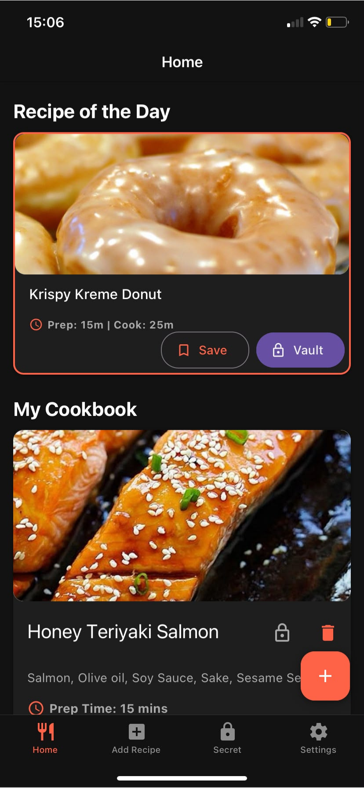
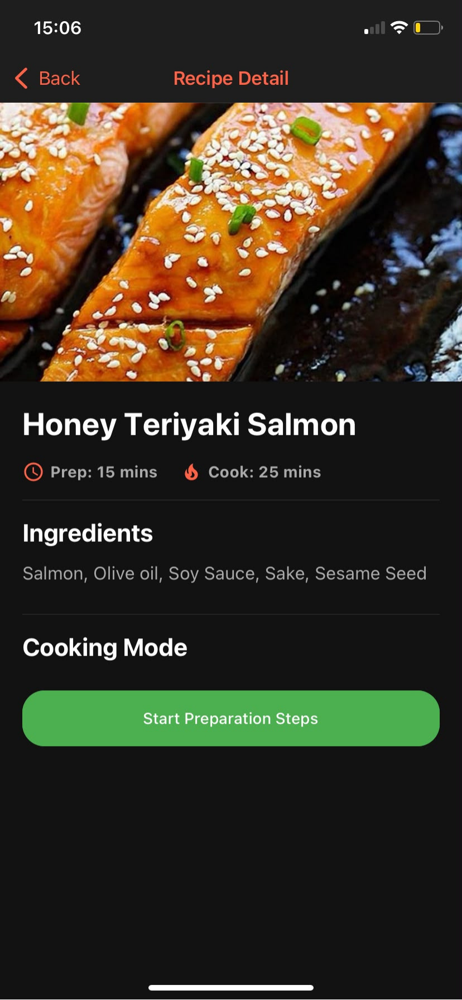
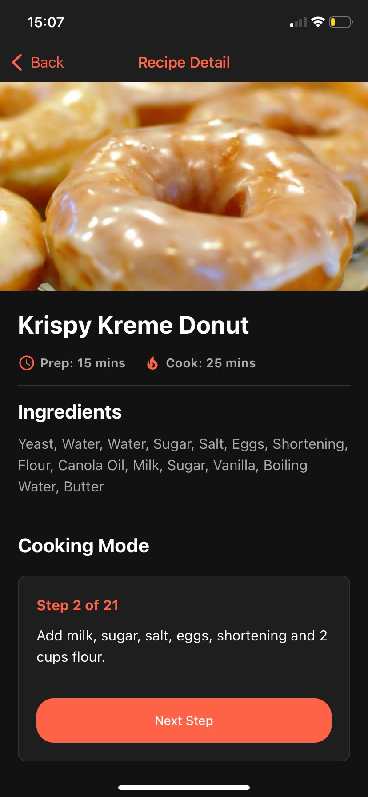

##Cookbook Vault
Cookbook Vault is an advanced recipe management application built with React Native (Expo), adhering to modern design trends and high-performance standards. It allows users to add their own recipes, discover global dishes via an asynchronous API integration, and securely store sensitive recipes in a hardware-encrypted secret vault.


## Key Features
* **Asynchronous API Integration:** Manages data fetching using -The Meal DB- API with dynamic loading spinners and error handling.
* **Smart Offline Caching:** Hydrates the UI with the last successfully fetched data from `AsyncStorage` during network drops.
* **Secure Secret Vault:** Complete security is ensured using `expo-secure-store`, providing hardware-level encryption for the vault PIN.
* **Interactive Cooking Mode:** Step-by-step preparation wizard.
* **Responsive UI:** Layouts use `flex` properties and `useWindowDimensions` to render flawlessly across both phones and tablets.
* **Global Error Handling:** A custom `React Error Boundary` catches unexpected runtime errors.
* **Performance Optimization:** Long list rendering is strictly managed via `FlatList` with `React.memo` and `useCallback`.
* **Data Validation:** Strict Input Validation using Regular Expressions (Regex) prevents harmful inputs.

## Tech Stack

* **Framework:** React Native (Expo SDK)
* **Navigation:** Expo Router 
* **Design:** React Native Paper
* **Storage:** AsyncStorage & Expo SecureStore
* **Testing:** Jest


## Screenshots
|  |  
|  |  |


## Project Architecture (Criterion 1)

A modular and clean architecture (Separation of Concerns) has been established in accordance with professional expectations:

```text
cookbook-app/
├── __tests__/         # Jest test files (Validation tests)
├── app/               # Expo Router screen routes
│   ├── (tabs)/        # Tab Navigation screens (Home, Add, Secret, Settings)
│   ├── recipe/        # Stack Navigation (Recipe detail page)
│   └── _layout.tsx    # Global Error Boundary and Root layout
├── assets/            # Icons, splash screens, and static images
├── components/        # Reusable UI components (e.g., RecipeCard)
├── constants/         # Global theme and color configurations (theme.ts)
├── context/           # Centralized Context API State management (RecipeContext.tsx)
└── utils/             # Universal helper functions and Regex validations
```


## Quick Start

Follow these steps to test the application locally:

1. **Clone the repository:**
   ```bash
   git clone [https://github.com/SeyfettinKeremSurupcu/cookbook-app.git](https://github.com/SeyfettinKeremSurupcu/cookbook-app.git)
   cd cookbook-app
   npm install
   npx expo start
